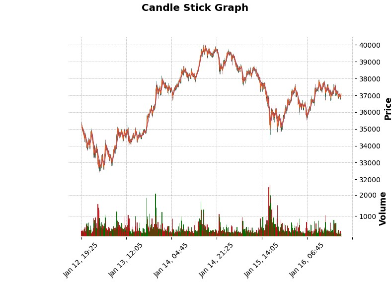
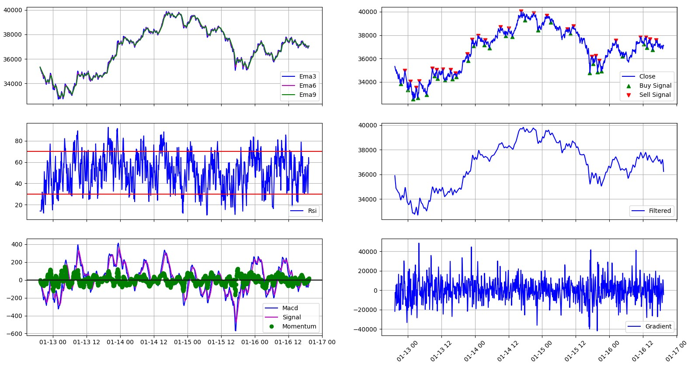

# AutomatedCryptoTrader
Bakalarska praca

Projekt je pripraveny na skumanie roznych vplyvov na doprednu neuronovu siet pri urcovani buy/sell signalov.
Cielom nebude generovanie co najvacsieho zisku, ale snaha co najviac priblizit vysledky neuronovej siete predlohe. 
To znamena co najpresnejsie trafit vhodny cas kupy/predaja, ktory na historickych datach predom urcime.

Grafy priebehov:

